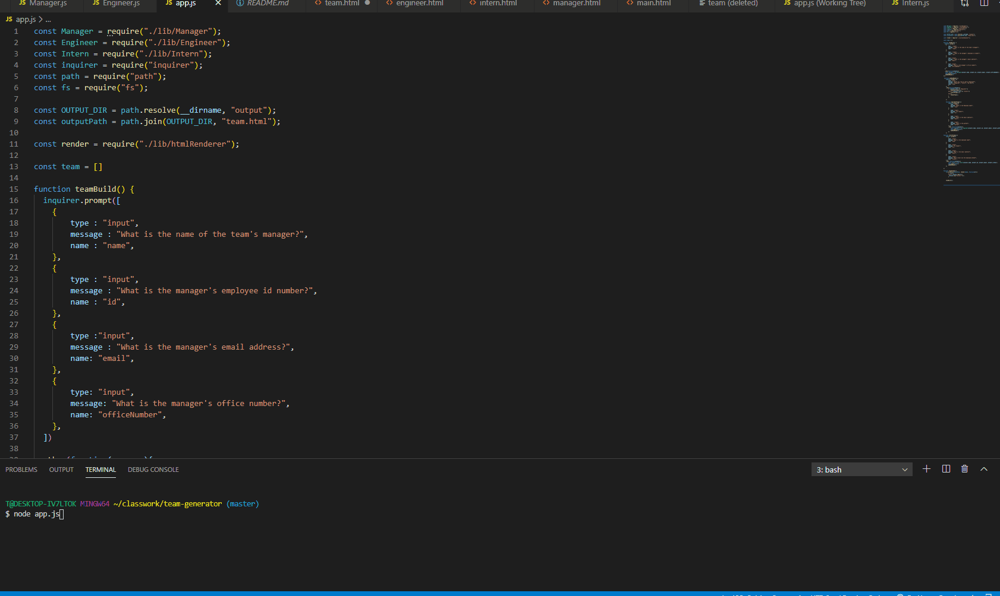

# team-generator

## Description
For this project, I created a team generator that uses a series of prompts to build a team by uses classes and constructors.  I also ran tests to make sure that it was correct.

## Table of Contents

*[Installation](#installation)

*[Usage](#usage)

*[Contributing](#contributing)

*[Test](#tests)

*[Questions](#questions)

## Installation

To install necessary dependencies, run the following command:

npm i

## Usage

To run the program you must type "node app.js" in the parent directory. The html will generate in the output file called team.html.  Prompts are set up for each team member and will generate in cards.  For each team there will be a manager and any number of employees.  

## Screenshot

## Contributing

Email me

## Tests

To run a test please type the following command:

npm run test

## Questions

If you have any questions,contact me at tsavage@gmail.com or visit my github: github.com/Savage1005

